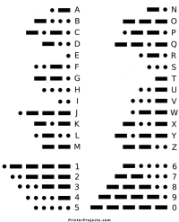
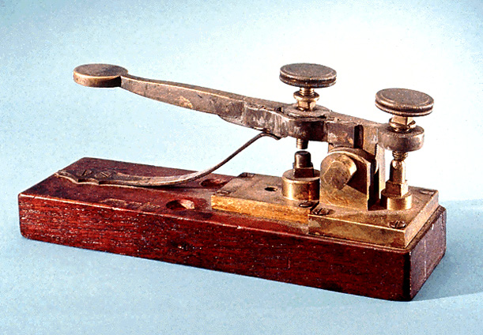
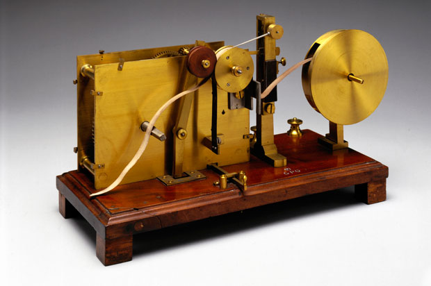

# Evolution of Communication

_Somke, Pigeon, Pony Express_

_Morse code_ (1832)
- Samue Morse (1791 - 1872)
- Industrial Revolution (1760 - 1840)

_Telegraph_
- 1844, Morse sent his first telegraph message from Washington D.C. to Baltimore Maryland.
- 1866, Telegraph line across the Atlantic Ocean from the US to Europe. 

_Flag Semaphore_
- US Army Major, Albert Myer (1850)

_Radio_
- James Clerk Maxwell (1864), mathematically proved the electormagnetic waves could propagate through free space.
- Heinrich Hertz (1886), establish the existence of electormagnetic waves.

_Telephone_
- Alexander Graham Bell (1876)

_Wireless Telegraph_
- Guglielmo Marconi (1895) build wireless telegraph, win Noble Prize in Physics at 1909.
- Nikola Tesla (1893) demo radio communication.

_Television_
- 1929, BBC.

_Wireless Telephone_
- 1946, Push-to-Talk (one way)
- 1960, two way.

_1G: Advanced Mobile Phone System (AMPS)_
- 1982, Bell Lab.

_2G: Global System for Mobile (GSM)_
- 1991, Finland.
- 9.6K bps data rate.

_2.5G: General Packet Radio Service (GPRS)_
- 1995.
- Packet Switch Network + GSM: 160K bps data rate.

_3G: Universal Mobile Telecommunications System (UMTS)_
- W-CDMA (refers to FDMA & TDMA).
- 1999, (1998 Internet boom)
- data rate: 384K bps ~ 28M bps (download) / 11M bps (upload)

_4G: Long Term Evolution (LTE)_
- 2009

_5G_
- 2018 
