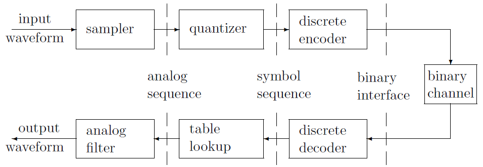

# The meaning of entropy for communication 
- Entropy (in bits) tells the average amount of information (in bits) that must be delieved in order to resolve the uncertainty about the outcome of a message.
- If send not enough bits, the receiver will have some uncertainty in the message.
- If send too much bits, we will wast the capacity of the communication channel.

# The digital communication system model
- Communication systems convert the source output into a binary sequence and then convert that binary sequence into a form suitable for transmission over particular physical media such as cable, twisted wire pair, optical fiber, or electromagnetic radiation through space.
- Digital communication systems use digital sequence as an interface between the source and the channel input and between the channel output and final destination.
- The source encoder converts the source output to a binary sequence and the channel encoder (often called a modulator) processes the binary sequence for transmission over the channel. The channel decoder (demodulator) recreates the incoming binary sequence (hopefully reliably), and the source decoder recreates the source output.

__EX: The communication system for waveform information__
- The source coding/decoding layer can be split into 3 layers:
    - sampler/analog filter
        - The input side of the converts the waveform into a sequence of samples and output side converts the recovered samples back to the waveform.
    - quantizer/table lookup
        - The quantizer converts each sample into symbol, and the peer module recreates the sample.
    - discrete encoder/decoder
        - To encode the sequence of symbols into binary digits and decode vice versa.
        

# The Source
- Discrete source
    - The discrete source is a sequence of a finite set of symbols, like numbers, characters or binary digits.
    - The discrete source code is uniquely decodable.
- Analog (wave) source
    - The wavefor source is a complex function of time.
    - Source encoding for analog sources involves a trade-off between the quantization bit rate and the amount of distortion.

# The Source Coding
- A conversion of a discrete memory less source (DMS) into a sequence of binary symbols.
    - DMS: independent probability
- To minimize the average bit rate required for representation of the source by reducing the redundancy of the information source.
- Shannon showed that the source entropy is equal to the minimum number of binary digits per source symbol required to map the source output into binary digits.

# Classification of Code:
- Fixed Length Codes
    - Code word length is fixed.
    - EX: 4 digits for Hexadecimal codes.
- Variable Length Codes
    - Code work lenght is not fixed.
    - Depends on the probability of symbols.
    - The idea of data compression.
    - EX: Huffman code.
- Distinct Codes
    - Each code word is distinguishable from each other. 
- Prefix Free Codes
    - No code word is prefix of another.
    - Every fixed-length code with distinct codewords is prefix-free.
    - Represent in binary code tree.
    - EX:  
    &nbsp;&nbsp;&nbsp;/ b -> 11  
    &nbsp;/\\/ c -> 101  
    &nbsp;\ a -> 0  
- Uniquely Decodable Codes
    - A distinct code is uniquely decodable if the original source sequece can be reconstructed from the encoded sequence.
- Instantaneous Codes
    - A uniquely decodable code if the end of any code word is recognizable without examining subsequence code symbols. (Prefix Free Codes)
- Optimal Codes
    - An instantaneous code and has the minimum average length for a given source.

__EX:__

|Xi|Code 1|Code 2|Code 3|Code 4|Code 5|Code 6|
|:---:|:---:|:---:|:---:|:---:|:---:|:---:|
|X1|00|00|0|0|0|1|
|X2|01|01|1|10|01|01|
|X3|00|10|00|110|011|001|
|X4|11|11|11|111|0111|0001|

# Homework (due date: 10/2)
1. Identify the _prefix free_ code and draw the decision tree.

|Xi|Code 1|Code 2|Code 3|Code 4|
|:---:|:---:|:---:|:---:|:---:|
|X1|0|0|0|00|
|X2|10|01|01|01|
|X3|110|001|011|10|
|X4|1110|0010|110|110|
|X5|1111|0011|111|111|

