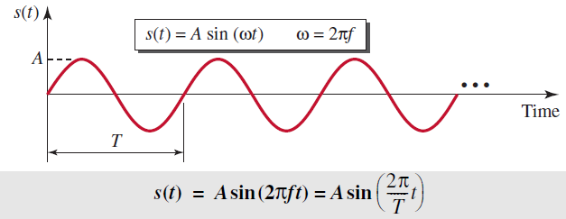
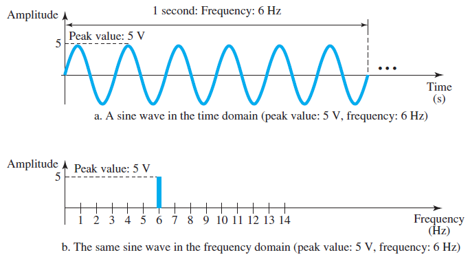
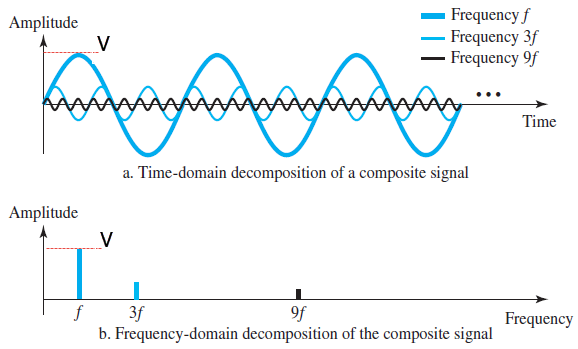
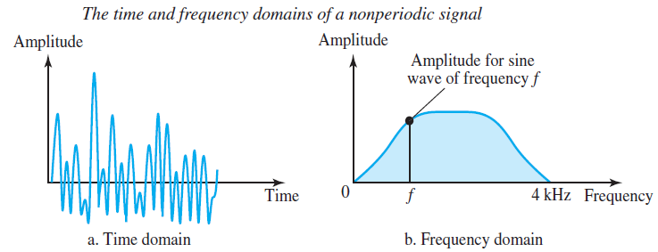
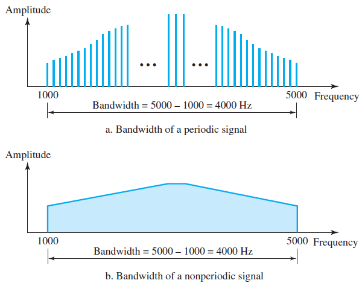

# Analog Signals
- __periodic signal__: with a repeat pattern in a period
- __nonperiodic signal__: without pattern or cycle that repeats over time

## Sine Wave

- peak amplitude (__A__) 
    - highest energy intensity (volt)
- period (__T__) 
    - how many seconds for a cycle of a signal
- frequency (___f___)
    - the number of periods in 1 second (Hz)
    - f=1/T, T=1/f
    > EX: 
    >
    > The period of home electricity supply (60 Hz) is
    >
    > T = 1/60 = 0.0166 seconds = 16.6 ms
    >
    > Our eyes can't detect so quick power change.
- phase (degree)
    - the position of the waveform relative to time 0 (horizontal shifting)
    > EX: same amplitude and frequency but different phase
- wavelength 
    - the length of a cycle of wave in a medium
    - propagration speed * period = propagration speed / frequency
    - &lambda;=c/f, c: speed of light (3 * 108 m/s)

## Time and Frequency Domain

__A complete sine wave in the time domain can be represented by one sigle spike in the frequency domain.__

### Time domain 
- the sine wave that defined by its amplitude, frequency and phase.
- shows the changes in signal amplitude with respect to time
- phase is not explicitly shown on a time-domain plot

### Frequency domain
- show the relationship between amplitude and frequency
- only concerned with the peak value and the frequency
- not show the amplitude changes during a period

## Composite Signals

__A composite signal is a combination of simple sine waves with different frequencies, amplitudes and phases.__
- __Periodic__ composite signal can be decomposed into a series of simple sine waves with discrete frequencies that have integer values.
- __Nonperiodic__ composite signal can be decomposed into a combination of an infinite number of simple sine waves with continuous frequencies that have real values.

## Bandwidth

__The bandwidth of a__ ___composite signal___ __is the difference between the highest and the lowest frequencies contained in that signal.__

> EX: 
>
> AM - bandwidth range from 530 kHz to 1700 kHz, each channel has 10 kHz.
>
> FM - bandwidth range from 88 MHz to 108 MHz, each channel has 100 kHz.

